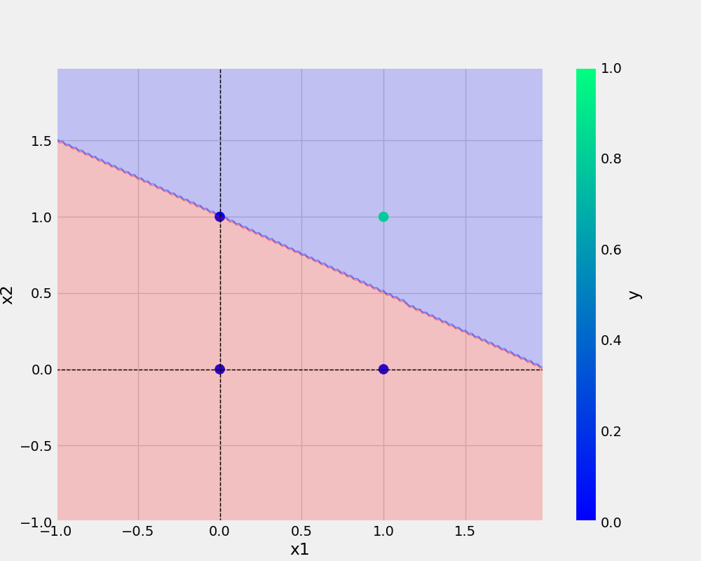

# PERCEPTRON-CLASS

BASICS OF PERCEPTRON CLASS

## basic comand

# 2 git clone https://github.com/premsaisahoo/PERCEPTRON.git

    3  git clone https://github.com/premsaisahoo/ERCEPTRON.git
    4  ls
    5  cd ERCEPTRON/
    6  code .
    7  mkdir utils
    8  touch and.py
    9  touch or.py

10 touch utils/**init**.py
11 touch utils/model.py
12 touch utils/all_utils.py
13 touch -r requirements.txt
14 touch requirements.txt
15 conda env list
16 conda activate oneneuron2
17 conda env list
18 history

## command used to run

git add . && git commit -m"docstring updated" && git push origin main
9 history

## ADD URL

[git handbook](https://readme.so/editor)

## ADD IMAGE

